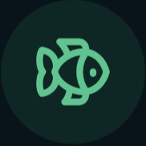

# Catch Logbook

<a id="readme-top"></a>

<!-- PROJECT LOGO -->

<br />
<div align="center">
  <a href="https://github.com/AllanRoz/catch-logbook">
    
  </a>

  <h3 align="center">CatchLog</h3>

  <p align="center">
    A modern fishing journal and analytics dashboard for anglers.
    <br />
    <br />
    <a href="https://allanroz.github.io/catch-logbook/">View Demo</a>
    &middot;
    <a href="https://github.com/AllanRoz/catch-logbook/issues/new?labels=bug&template=bug-report---.md">Report Bug</a>
    &middot;
    <a href="https://github.com/AllanRoz/catch-logbook/issues/new?labels=enhancement&template=feature-request---.md">Request Feature</a>
  </p>
</div>

<!-- ABOUT THE PROJECT -->

## About The Project

[![Product Screenshot][product-screenshot]](https://allanroz.github.io/catch-logbook/)

**CatchLog** is a modern web application that allows anglers to log fishing trips, record catches, and analyze their fishing history through an intuitive dashboard. Rather than keeping handwritten notes or scattered spreadsheets, CatchLog provides a centralized digital journal where users can track every outing, organize their catches, and gain insights into their fishing habits.

Built as a fully static React application, all data is stored locally in the browser using LocalStorage, making it fast, private, and perfect for hosting on GitHub Pages without requiring a backend or user accounts.

### Key Features

* **Fishing Trip Journal:** Log detailed information about every fishing trip, including location, date, weather conditions, equipment, and notes.
* **Catch Tracking:** Record species, length, weight, bait or lure used, fishing technique, and whether the fish was released or kept.
* **Interactive Dashboard:** View personal fishing statistics including total trips, total catches, favorite species, largest fish, and average catch size.
* **Powerful Search & Filters:** Quickly search and filter trips by species, location, lure, technique, water type, or date.
* **Trip Management:** Create, edit, duplicate, and delete fishing trips with an intuitive interface.
* **Photo Gallery:** Upload and organize photos from each fishing trip to preserve memorable catches.
* **Analytics & Charts:** Visualize fishing history with interactive charts showing catch trends, species distribution, seasonal activity, and more.
* **Personal Bests:** Automatically track record catches including largest fish, heaviest fish, longest fish, and most successful trips.
* **Local Data Storage:** All data is securely stored in the browser using LocalStorage with optional JSON export and import for backups.

<p align="right">(<a href="#readme-top">back to top</a>)</p>

### Built With

* [![React][React.js]][React-url]
* [![JavaScript][JavaScript.js]][JavaScript-url]
* [![Vite][Vite.dev]][Vite-url]
* [![TailwindCSS][Tailwind.css]][Tailwind-url]
* [![Chart.js][Chart.js]][Chart-url]

<p align="right">(<a href="#readme-top">back to top</a>)</p>

<!-- GETTING STARTED -->

## Getting Started

Follow these steps to set up and run a local copy of the project on your machine.

### Prerequisites

* npm

  ```sh
  npm install npm@latest -g
  ```

### Installation and Running Locally

1. Clone the repository

   ```sh
   git clone https://github.com/AllanRoz/catch-logbook.git
   ```

2. Navigate into the project directory

   ```sh
   cd catch-logbook
   ```

3. Install project dependencies

   ```sh
   npm install
   ```

4. Start the development server

   ```sh
   npm run dev
   ```

5. Build for production

   ```sh
   npm run build
   ```

6. Preview the production build

   ```sh
   npm run preview
   ```

<p align="right">(<a href="#readme-top">back to top</a>)</p>

<!-- FEATURES -->

## Features

### 🎣 Fishing Journal

Record every fishing trip with detailed information including:

* Date and time
* Fishing location
* Water type
* Weather conditions
* Water temperature
* Personal notes
* Photos

### 🐟 Catch Log

Track every fish you catch with:

* Species
* Length
* Weight
* Lure or bait
* Rod and reel setup
* Fishing technique
* Released or kept

### 📊 Analytics Dashboard

Monitor your fishing performance with charts displaying:

* Total catches
* Favorite species
* Monthly fishing activity
* Catch trends
* Most successful lures
* Largest catches
* Fishing frequency

### 🏆 Personal Bests

Automatically maintain records for:

* Largest fish
* Longest fish
* Heaviest fish
* Most fish caught in one trip
* Longest fishing trip

### 🔍 Search & Organization

Quickly find previous trips by filtering with:

* Species
* Date
* Location
* Lure
* Technique
* Water type

### 💾 Local Storage

Your fishing journal remains completely private.

* No accounts required
* No cloud storage
* No backend server
* Automatic LocalStorage persistence
* Import and export your journal as JSON

<p align="right">(<a href="#readme-top">back to top</a>)</p>

<!-- FUTURE IMPROVEMENTS -->

## Future Improvements

Planned features include:

* Interactive fishing map with saved fishing locations
* Weather history integration
* Moon phase tracking
* GPS route recording
* Catch heatmaps
* Offline Progressive Web App (PWA) support
* Achievement badges
* Fishing trip sharing
* Equipment inventory management
* Advanced analytics and AI-powered catch insights

<p align="right">(<a href="#readme-top">back to top</a>)</p>

<!-- LICENSE -->

## License

Distributed under the GPL-3.0 License. See the `LICENSE` file for more information.

<p align="right">(<a href="#readme-top">back to top</a>)</p>

<!-- CONTACT -->

## Contact

Allan Rozario - [arozadev@gmail.com](mailto:arozadev@gmail.com)

Project Link: https://github.com/AllanRoz/catch-logbook

Live Demo: https://allanroz.github.io/catch-logbook/

<p align="right">(<a href="#readme-top">back to top</a>)</p>

<!-- MARKDOWN LINKS & IMAGES -->

[product-screenshot]: public/CatchLog.png
[React.js]: https://img.shields.io/badge/React-20232A?style=for-the-badge&logo=react&logoColor=61DAFB
[React-url]: https://react.dev/
[JavaScript.js]: https://img.shields.io/badge/JavaScript-F7DF1E?style=for-the-badge&logo=javascript&logoColor=black
[JavaScript-url]: https://developer.mozilla.org/en-US/docs/Web/JavaScript
[Vite.dev]: https://img.shields.io/badge/Vite-646CFF?style=for-the-badge&logo=vite&logoColor=white
[Vite-url]: https://vite.dev/
[Tailwind.css]: https://img.shields.io/badge/Tailwind_CSS-06B6D4?style=for-the-badge&logo=tailwindcss&logoColor=white
[Tailwind-url]: https://tailwindcss.com/
[Chart.js]: https://img.shields.io/badge/Chart.js-FF6384?style=for-the-badge&logo=chartdotjs&logoColor=white
[Chart-url]: https://www.chartjs.org/
